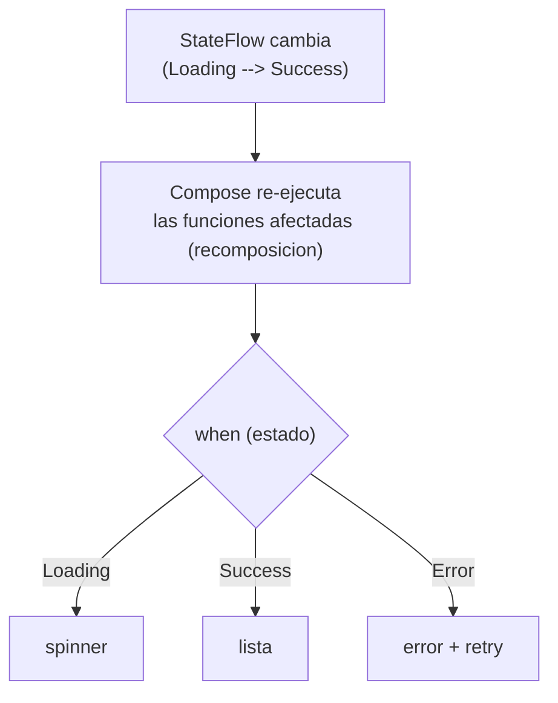
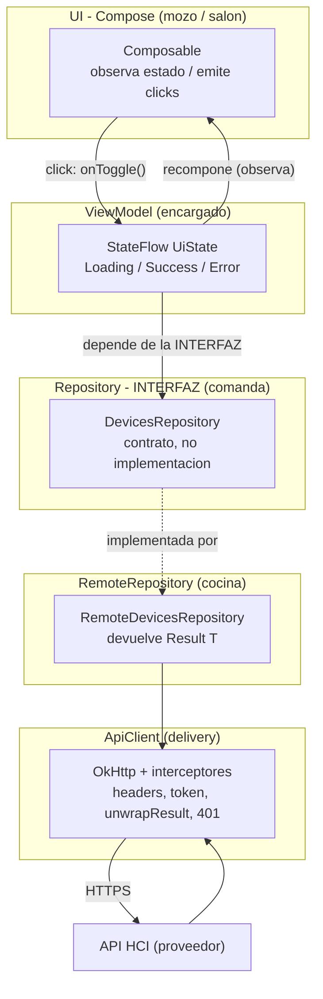
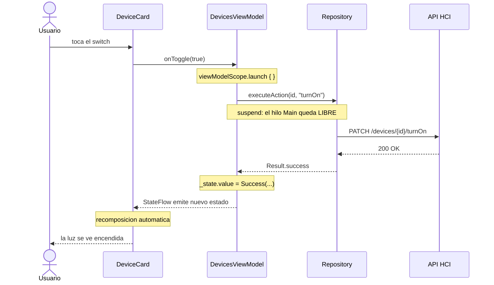
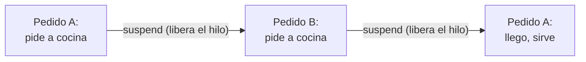
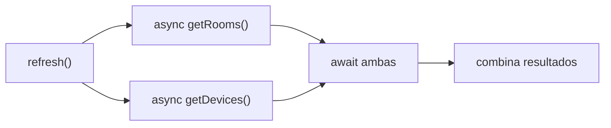
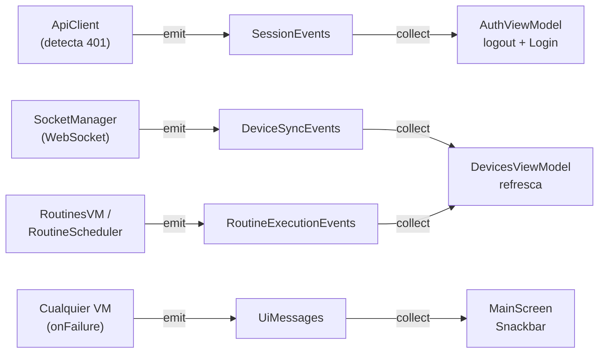
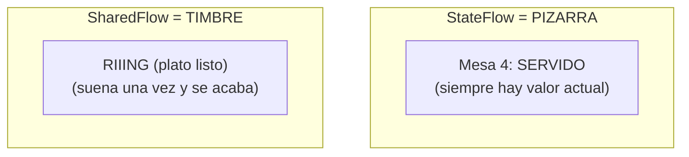
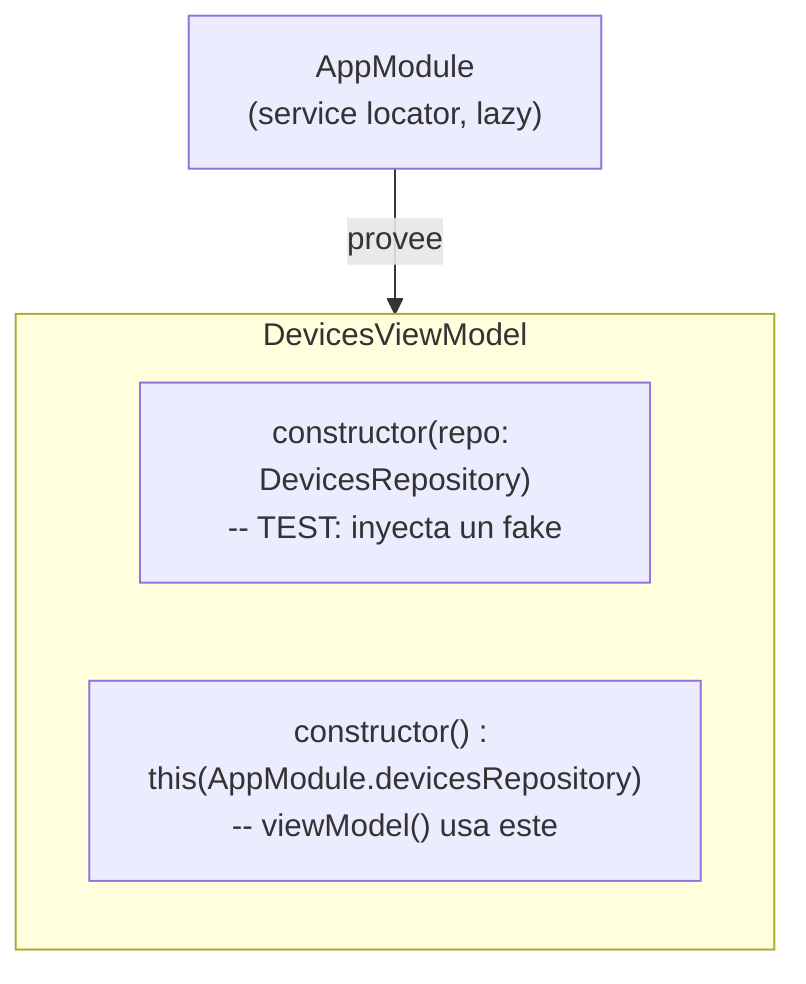
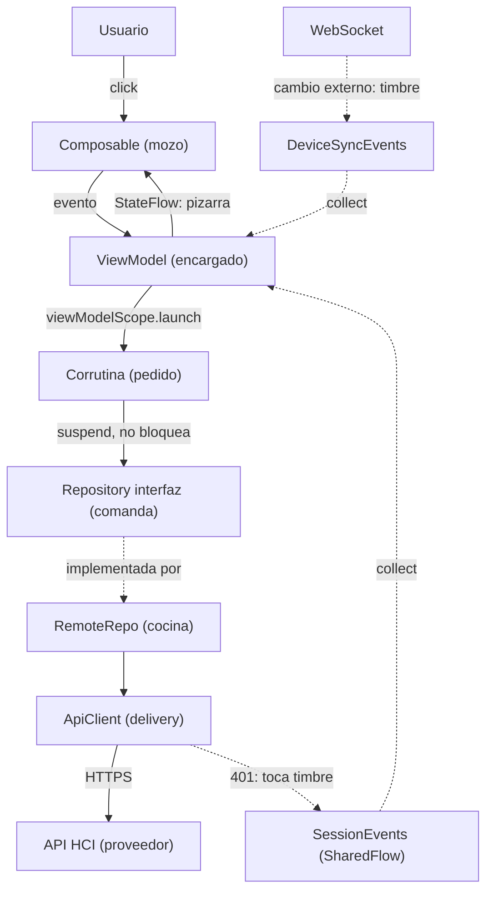

# HomeCore - Guia Completa: Como Funciona Todo

> Guia maestra de estudio para la defensa. Explica como funciona la app de punta
> a punta: arquitectura, Compose declarativo, flujo de datos, estado y
> concurrencia. Usa una analogia central (un **restaurante**) y diagramas
> **Mermaid** (se renderizan en VS Code con la extension Mermaid, o en
> mermaid.live). Todo aterrizado en el codigo real.
>
> Este documento integra y reemplaza a `concurrencia_explicada.md` y
> `arquitectura_diagramas.md`: es la fuente unica.

---

## Indice

1. [La analogia madre: el restaurante](#1-la-analogia-madre-el-restaurante)
2. [Que es la app y como esta hecha](#2-que-es-la-app-y-como-esta-hecha)
3. [Compose: programacion declarativa (UI = f(estado))](#3-compose-programacion-declarativa-ui--festado)
4. [Arquitectura en capas (MVVM)](#4-arquitectura-en-capas-mvvm)
5. [El flujo de una accion, paso a paso](#5-el-flujo-de-una-accion-paso-a-paso)
6. [El estado: StateFlow y sealed UiState](#6-el-estado-stateflow-y-sealed-uistate)
7. [.value vs .update: cuando cada uno](#7-value-vs-update-cuando-cada-uno)
8. [Concurrencia: corrutinas y "suspender"](#8-concurrencia-corrutinas-y-suspender)
9. [Cooperativo, no preemptivo](#9-cooperativo-no-preemptivo)
10. [Dispatchers y de donde sale Main.immediate](#10-dispatchers-y-de-donde-sale-mainimmediate)
11. [async/await: paralelizar esperas](#11-asyncawait-paralelizar-esperas)
12. [Cambio de hilo: solo en puntos de suspension](#12-cambio-de-hilo-solo-en-puntos-de-suspension)
13. [Buses de eventos (SharedFlow)](#13-buses-de-eventos-sharedflow)
14. [Inyeccion de dependencias](#14-inyeccion-de-dependencias)
15. [Tiempo real (WebSocket)](#15-tiempo-real-websocket)
16. [Navegacion](#16-navegacion)
17. [Estructura de paquetes](#17-estructura-de-paquetes)
18. [Mapa mental completo](#18-mapa-mental-completo)
19. [Tabla de traduccion analogia - codigo](#19-tabla-de-traduccion-analogia---codigo)
20. [Frases listas para la defensa](#20-frases-listas-para-la-defensa)

---

## 1. La analogia madre: el restaurante

Casi todo lo de esta guia entra en esta escena:

| En el restaurante | En el codigo | Por que |
|---|---|---|
| El **mozo** | Un **hilo** (thread) | Hace el trabajo, una cosa a la vez |
| Un **pedido en curso** | Una **corrutina** | Una tarea que avanza, se pausa, retoma |
| "Esta mesa espera la cocina" | Un **punto de suspension** | El momento en que la tarea cede el control |
| La **cocina** | El **pool de OkHttp** (la red) | Trabajo pesado que ocurre aparte |
| El **encargado** que asigna mozos | El **dispatcher** | Define en que hilo corre cada cosa |
| La **comanda** (papelito) | La **interfaz** de repositorio | Un contrato: "quiero esto", no dice quien cocina |
| La **pizarra de estado** | El **StateFlow** | Muestra el estado actual de cada mesa |
| El **timbre de la cocina** | El **SharedFlow** | Suena una vez cuando algo pasa |

Regla mental para toda la guia: **un mozo no se queda parado mirando la puerta de
la cocina**. Deja el pedido y atiende otra mesa; cuando el plato esta listo,
vuelve. Eso es una corrutina suspendiendose.

---

## 2. Que es la app y como esta hecha

HomeCore mobile es una app Android **nativa**, 100% **Jetpack Compose + Material
3** (no hay XML de layouts ni Fragments). Arquitectura **MVVM estricta por
capas**. Consume la API REST de la catedra. La UI y los ViewModels dependen de
**interfaces** de repositorio, no de implementaciones concretas.

Stack: Kotlin, Compose, Coroutines + StateFlow, Retrofit/OkHttp (y Ktor en
rutinas), DataStore, Socket.IO.

El concepto que sostiene todo: **inversion de dependencias**. Cada capa conoce a
la de abajo solo a traves de una abstraccion.

---

## 3. Compose: programacion declarativa (UI = f(estado))

Compose es **programacion declarativa** aplicada a la UI.

- **Imperativo** = describis el *como*, paso a paso: "busca el TextView, cambiale
  el texto, ocultá el spinner, mostrá la lista". Vos mantenes la UI sincronizada
  con el estado en cada transicion.
- **Declarativo** = describis el *que*, en funcion del estado: "si el estado es
  Loading, mostrá un spinner; si es Success, mostrá la lista". No describis la
  transicion: el framework redibuja cuando el estado cambia.

La frase que lo resume: **UI = f(estado)**. La interfaz es una funcion del
estado. Mismo estado, misma UI.

En tu codigo se ve literal:

```kotlin
when (val s = state) {
    is DevicesUiState.Loading -> LoadingIndicator()
    is DevicesUiState.Success -> DevicesList(s.rooms, s.devices)
    is DevicesUiState.Error   -> ErrorMessage(s.message, onRetry = viewModel::load)
}
```



**Analogia:** un termostato con display. No programas "cuando suba un grado,
borra el numero y dibuja el nuevo". Declaras "el display muestra la temperatura
actual". El display es **funcion de** la temperatura: se actualiza solo.

**Matiz honesto:** Compose es declarativo pero no funcional puro. Tiene escotillas
hacia lo imperativo cuando hacen falta: `remember`/`rememberSaveable` para estado
local, `LaunchedEffect`/`DisposableEffect` para efectos secundarios. La regla del
proyecto de no llamar al repositorio desde `LaunchedEffect` es justamente para
mantener los efectos en su lugar y que la UI siga siendo funcion del estado.

---

## 4. Arquitectura en capas (MVVM)

El esqueleto. Hay que saber dibujarlo de memoria.



**Explicacion:** la regla de oro es que cada capa solo conoce a la de abajo a
traves de una abstraccion. El ViewModel apunta a la *interfaz*
`DevicesRepository`, no a `RemoteDevicesRepository`. Eso es **inversion de
dependencias**: la implementacion concreta (Retrofit) es un detalle
intercambiable; lo demostramos usando Ktor en el repositorio de rutinas sin
tocar UI ni ViewModel. La unica flecha de abstracto a concreto es "implementada
por" (punteada); todas las demas dependencias apuntan a abstracciones.

**Analogia:** el cliente nunca habla con la cocina. Le habla al mozo (Composable),
el mozo pasa la comanda (interfaz) al encargado (ViewModel), el encargado la
manda a la cocina (RemoteRepository). La comanda no dice **quien** cocina: si
cambias de cocinero (Retrofit por Ktor), el mozo y el encargado ni se enteran.

---

## 5. El flujo de una accion, paso a paso

El sistema en movimiento. Ejemplo: el usuario prende una luz.



**Explicacion:** el click no toca la red directamente. El composable solo emite
un evento al ViewModel. El ViewModel lanza una corrutina en `viewModelScope`,
llama al repositorio (que **suspende** mientras espera la red, sin bloquear el
hilo de UI), y al volver actualiza su `StateFlow`. Como la UI lo observa, la
recomposicion es automatica: nunca dijimos "cambia el icono a encendido", solo
cambiamos el estado.

---

## 6. El estado: StateFlow y sealed UiState

Cada pantalla con datos asincronos expone un `StateFlow` de una `sealed class`:

```kotlin
sealed class DevicesUiState {
    object Loading : DevicesUiState()
    data class Success(val rooms: List<Room>, val devices: List<Device>) : DevicesUiState()
    data class Error(val message: String) : DevicesUiState()
}
```

**Por que importa:** modelar el estado asi **elimina estados invalidos**. No
podes estar "cargando" y "con error" a la vez. El `when (state)` del composable es
**exhaustivo**: el compilador te obliga a contemplar los tres casos.

El patron es de **encapsulacion**: el `_state` mutable es privado; afuera se
expone solo el `StateFlow` de lectura (`asStateFlow()`). La UI lo consume con
`collectAsStateWithLifecycle()`, que respeta el ciclo de vida.

**Analogia:** la pizarra del salon siempre muestra **un** estado por mesa
("cocinando" / "servido" / "se quemo"), nunca dos a la vez.

---

## 7. .value vs .update: cuando cada uno

**La regla en una linea:**
- `.value =` cuando asignas un **valor absoluto** que no depende del anterior.
- `.update {}` cuando el **valor nuevo se deriva del actual** (leer-modificar-escribir).

**Caso `.value =` - valor absoluto (DevicesViewModel, AuthViewModel,
RoutinesViewModel.load, HomesViewModel.load, ThemeViewModel):** el estado es un
sealed o un valor que asignas completo, sin mirar el anterior:

```kotlin
_state.value = DevicesUiState.Success(rooms, enriched)   // no mira lo que habia antes
```

Tambien `RoutineEditorViewModel` usa `.value =` cuando **construye un estado nuevo
de cero** al empezar a editar (`_state.value = RoutineEditorState(...)`, lineas 67
y 75): es construccion fresca, no derivacion, asi que `.value =` es correcto.

**Caso `.update {}` (RoutineEditorViewModel):** el estado es una sola data class
con muchos campos, y cada setter cambia uno manteniendo el resto:

```kotlin
fun setName(v: String) = _state.update { it.copy(name = v) }

fun toggleDay(day: Int) = _state.update {
    it.copy(days = if (day in it.days) it.days - day else it.days + day)   // LEE days, decide, ESCRIBE
}
```

**Que hace `.update {}` por dentro:** aplica una lambda `(T) -> T` de forma
atomica con un bucle compare-and-set. Lee el valor actual, calcula el nuevo, y si
alguien lo cambio en el medio, reintenta con el valor fresco. Asi dos
modificaciones derivadas no se pisan.

**El mito que conviene desarmar:** circula una "correccion" que dice que
`_state.value = X` "no es thread-safe" y hay que reemplazar todo por `.update`.
Es incorrecta:
1. El setter `.value` **ya es thread-safe** (atomico, con visibilidad correcta).
   Si dos escriben, gana el ultimo: resultado bien definido, no corrupcion.
2. `.update {}` solo agrega valor en **leer-modificar-escribir**; nuestras
   asignaciones de sealed son **valores absolutos**, no dependen del anterior.
3. Ademas todo corre en un solo hilo (Main, ver seccion 10): no hay mutacion
   concurrente.

**Analogia:** `.value =` es borrar la pizarra y escribir un estado nuevo de cero.
`.update {}` es leer lo que dice, tacharle un detalle y reescribir el resto igual.
Solo el segundo necesita el protocolo de releer-y-reintentar para no pisar a otro.

### 7.1 Las dos excepciones reales (importante saberlas)

Para ser honestos: hay **dos lugares** que son leer-modificar-escribir pero estan
hechos con `.value =` en vez de `.update {}`, contra la regla de arriba:

- `HomesViewModel.selectHome` (lineas 60-61):
  ```kotlin
  val current = _state.value as? HomesUiState.Success ?: return   // LEE
  _state.value = current.copy(selectedHome = home)                // ESCRIBE (derivado)
  ```
- `RoutinesViewModel.replaceRoutine` (lineas 100-105):
  ```kotlin
  val current = _state.value as? RoutinesUiState.Success ?: return       // LEE
  _state.value = current.copy(routines = current.routines.map { ... })   // ESCRIBE (derivado)
  ```

Las dos son **benignas hoy**: entre la lectura y la escritura no hay ningun
`suspend`, asi que corren de un saque en el hilo principal y nadie se intercala.
Pero son **fragiles**: el dia que alguien meta un `await` en el medio, se romperia
en silencio (lost update). La version robusta y consistente con la regla seria
`.update { }`:

```kotlin
fun selectHome(home: Home) {
    currentSelectedHome = home
    _state.update { (it as? HomesUiState.Success)?.copy(selectedHome = home) ?: it }
}
```

> Conclusion honesta: el proyecto usa la herramienta correcta en la **gran
> mayoria** de los casos, y `RoutineEditorViewModel` es el ejemplo modelo (`.value
> =` para construir de cero, `.update` para modificar campos). Quedan **dos
> excepciones** (selectHome y replaceRoutine) que hoy son seguras pero conviene
> alinear a `.update`. En la defensa: mejor reconocerlas y explicar por que son
> benignas que afirmar "siempre usamos la herramienta correcta" y que te
> encuentren la excepcion.

---

## 8. Concurrencia: corrutinas y "suspender"

Primero, dos palabras que se confunden:
- **Concurrencia**: varias tareas en progreso intercalandose. Un mozo, cinco
  mesas. No necesita varios mozos.
- **Paralelismo**: varias tareas en el mismo instante exacto. Cinco mozos. Necesita
  varios hilos sobre varios nucleos.

Las corrutinas **siempre** dan concurrencia; el paralelismo depende del dispatcher.

Una corrutina es una tarea que puede **pausarse y retomarse**. La clave es
distinguir **suspender** de **bloquear**:
- **Bloquear** = el mozo parado frente a la cocina. Desperdicia al mozo.
  (`Thread.sleep`, red sincronica en el hilo de UI.)
- **Suspender** = el mozo deja el pedido y atiende otra mesa; retoma cuando el
  plato esta. **No bloquea: libera al mozo.**

En el codigo, toda la capa de datos es `suspend`:

```kotlin
override suspend fun getDevices(): Result<List<Device>> = runCatching {
    apiCall("Error al obtener dispositivos") {
        val devices = devicesApi.getAllDevices()   // SUSPENDE hasta que vuelve la red
        ...
    }
}
```

`suspend` es un contrato: solo se puede llamar desde otra corrutina o funcion
suspend. Garantiza, estructuralmente, que la red nunca se llame fuera de una
corrutina.



**Por que son baratas:** miles de corrutinas corren sobre pocos hilos, porque
cuando una suspende libera el hilo. Un hilo por tarea seria carisimo.

---

## 9. Cooperativo, no preemptivo

La diferencia que mas impresiona si la explicas bien.

Un **hilo** lo puede frenar el SO **en cualquier instruccion** (preempcion): como
un jefe que arranca al mozo a mitad de una frase. Una **corrutina NO**: cede el
control solo en **puntos de suspension** (las llamadas `suspend`). Es
**cooperativa**: el mozo elige cuando cambiar de mesa.

Consecuencia enorme: **entre dos puntos de suspension, el codigo corre de punta a
punta sin que nadie se meta.** Es una seccion critica gratis, sin locks.

```kotlin
viewModelScope.launch {
    repository.executeAction(deviceId, action, params)   // <-- UNICO punto de suspension
        .onSuccess { refresh(showLoading = false) }
        .onFailure { UiMessages.emit(it.message ?: "...") }
}
```

El `_state.value = X` nunca es interrumpido a la mitad, porque una asignacion
simple no suspende y, en un solo hilo, nadie corre hasta que la corrutina actual
suspenda. Los puntos de suspension son **visibles** (las llamadas suspend): no hay
sorpresas ocultas.

---

## 10. Dispatchers y de donde sale Main.immediate

El **dispatcher** decide en que hilo corre cada corrutina. No es el SO quien
decide el paralelismo: lo decide el dispatcher, porque define cuantos hilos hay.

| Dispatcher | Hilos | Paralelismo | Para que |
|---|---|---|---|
| `Main` / `Main.immediate` | 1 (UI) | **No** | Tocar la UI, actualizar estado |
| `Default` | ~nucleos | Si (CPU) | Calculo pesado |
| `IO` | pool grande (64+) | Si (I/O) | Red, disco |

Con un dispatcher de un solo hilo, el SO **no puede** paralelizar esas
corrutinas: hay un solo mozo.

**De donde sale `Main.immediate`:** NO esta escrito en tu codigo. Viene implicito
en `viewModelScope`, definido en `androidx.lifecycle`:

```kotlin
// Dentro de androidx.lifecycle, NO en tu repo
val ViewModel.viewModelScope: CoroutineScope
    get() = ... ?: CloseableCoroutineScope(
                SupervisorJob() + Dispatchers.Main.immediate   // <-- aca
            )
```

Por eso todos tus `viewModelScope.launch { ... }`, al no pasar dispatcher,
heredan **Main.immediate** y corren en el hilo principal.

**`Main` vs `Main.immediate`** (los dos son un solo hilo): `Main` siempre encola
el trabajo (un rebote por el event loop); `Main.immediate` ejecuta en el acto si
ya estas en el hilo principal. Es optimizacion de latencia, **no** de
thread-safety. Lo que evita carreras es que sea **un solo hilo**, no el
`.immediate`.

El unico dispatcher explicito del proyecto es `Dispatchers.IO` en
`RoutineScheduler`, que hace polling de red fuera de toda pantalla.

---

## 11. async/await: paralelizar esperas

- **`launch`** = "anda, no me traigas nada" (limpiar una mesa).
- **`async`** = "anda y traeme el resultado" (cocinar un plato). Devuelve
  `Deferred<T>`.
- **`await()`** = "espera hasta que ese plato este".

El mejor ejemplo, `DevicesViewModel.refresh()`:

```kotlin
val (roomsRes, devicesRes) = coroutineScope {
    val rooms   = async { repository.getRooms() }     // dispara pedido 1
    val devices = async { repository.getDevices() }   // dispara pedido 2 (sin esperar el 1)
    rooms.await() to devices.await()                  // espera ambos
}
```



Como pedis los dos antes de esperar a ninguno, los round-trips se solapan:
**tiempo total = el mas lento, no la suma**. Y este speedup **no necesita varios
nucleos**: viene de solapar esperas de I/O no bloqueantes. La red real corre en
hilos de OkHttp, pero el beneficio lo tendrias igual con un solo mozo.

`coroutineScope { }` ademas aporta seguridad: si uno falla, cancela el otro y
propaga el error (todos o ninguno).

---

## 12. Cambio de hilo: solo en puntos de suspension

"El cuerpo del launch, puede saltar a otro hilo en el medio?" Un cambio de hilo
es posible, pero con dos condiciones: (a) solo en un punto de suspension, nunca
en el medio de un bloque; y (b) solo si el dispatcher tiene varios hilos o lo
pedis con `withContext`.

En tus ViewModels **no se da ninguna**, asi que el cuerpo del `launch` **nunca
ejecuta en otro hilo**:
- El dispatcher es `Main.immediate` = un solo hilo: al reanudar tras una
  suspension, siempre vuelve a Main.
- Nunca usan `withContext(Dispatchers.IO)` ni `launch(Dispatchers.Default)` en un
  ViewModel.

La red **si** corre en hilos de OkHttp, pero eso pasa **adentro** de la funcion
suspend de Retrofit, no es que tu corrutina migre. El recorrido: corre en Main,
suspende, OkHttp cocina en su pool, devuelve el plato, tu codigo retoma en Main.

Asi se veria un salto explicito (NO esta en el proyecto, es contraste):

```kotlin
viewModelScope.launch {                 // arranca en Main
    val data = withContext(Dispatchers.IO) {
        parseHugeFile()                 // ESTE bloque corre en un hilo de IO
    }                                   // vuelve a Main al salir
    _state.value = Success(data)        // de nuevo en Main
}
```

El unico caso parecido es `RoutineScheduler`, que corre entero en `Dispatchers.IO`
desde el arranque del scope (no es un salto en el medio).

---

## 13. Buses de eventos (SharedFlow)

Comunicacion desacoplada entre componentes que no se conocen entre si.



**Explicacion:** la capa de red no conoce al `AuthViewModel`: solo **emite** un
evento de 401 en `SessionEvents`, y quien quiera reacciona. Desacople total entre
emisor y receptor.

**StateFlow vs SharedFlow** (la confusion clasica):



- **StateFlow** = estado (valor actual): "que se ve en pantalla" (lista,
  Loading/Success/Error).
- **SharedFlow** = evento de una sola vez: 401, snackbar, "refresca". Si un evento
  fuera StateFlow, al rotar se re-emitiria (el snackbar saldria de nuevo). Por eso
  los eventos van en SharedFlow.

---

## 14. Inyeccion de dependencias

Por que el doble constructor en los ViewModels.



**Explicacion:** Compose instancia los ViewModels con `viewModel()`, que necesita
un constructor sin argumentos. Pero tambien queriamos inyectar un repositorio
falso en tests. Solucion: doble constructor. El primario recibe la dependencia
(tests); el secundario la resuelve desde `AppModule` (produccion). Service locator
simple en vez de Hilt, para no sumar complejidad de build a un proyecto academico.

---

## 15. Tiempo real (WebSocket)

`SocketManager` (Socket.IO) conecta al loguear y escucha eventos del servidor
(`deviceEvent`, `deviceCreated`, `deviceDeleted`, `homeShared`, ...). Ante un
cambio externo:
1. Refresca el estado en vivo (`DeviceSyncEvents` -> `DevicesViewModel`).
2. Notifica el cambio (`NotificationEvents` -> `AppNotifier`).

Como el server reenvia al propio emisor, se **suprime el eco propio** (por
`deviceId`, marcado en `runAction`/create/delete) y se **dedupea** por device. El
payload solo trae `deviceId`, asi que el nombre se resuelve con `DeviceRegistry`
(un mapa id->nombre que mantiene `DevicesViewModel`).

**Limitacion documentada:** el socket y `RoutineScheduler` corren mientras la app
esta viva; notificaciones con la app cerrada requeririan WorkManager/foreground
service (fuera del alcance).

---

## 16. Navegacion

Navegacion **manual**, no Navigation Compose. `MainActivity` maneja el flujo de
auth con un `enum AppScreen` (LOGIN, REGISTER, VERIFY, RECOVER, HOME) y, una vez
logueado, monta `MainScreen` con una bottom navigation de 5 tabs (que en tablet
se vuelve `NavigationRail`).

Es una **decision deliberada y documentada** (ver `DECISIONES_ARQUITECTURA.md`
seccion 8): para este alcance, la navegacion manual con estado es mas
transparente. `navigation/` (Navigation Compose) quedo sin uso. En la defensa:
estar listo para justificar el trade-off (sin deep links ni animaciones
automaticas, que el enunciado no pide).

---

## 17. Estructura de paquetes

La organizacion fisica refleja la arquitectura.

```
com.itba.homecore
|
+-- MainActivity.kt            (navegacion: enum AppScreen)
|
+-- data/                      [CAPA DE DATOS]
|   +-- api/                   Retrofit/Ktor, ApiClient, SessionEvents, SocketManager
|   +-- model/                 Device, Routine, Room, User + extensiones de dominio
|   +-- repository/            interfaces + Remote* (implementaciones)
|   +-- local/                 SessionManager (DataStore)
|
+-- di/                        AppModule (service locator)
|
+-- viewmodel/                 [PRESENTACION] StateFlow<UiState> + *Events.kt (buses)
|
+-- ui/                        [UI - Compose]
|   +-- screens/               auth/ main/ devices/ routines/
|   +-- components/            HcButton, HouseHeader, UniformGrid (slots)
|   +-- theme/                 Color, Type, Dimens (design tokens)
|   +-- util/                  WindowSize (isWideScreen para tablet)
|
+-- util/                      AppNotifier, RoutineScheduler, LocaleManager
```

---

## 18. Mapa mental completo



---

## 19. Tabla de traduccion analogia - codigo

| Concepto | Analogia | Donde en el codigo |
|---|---|---|
| Hilo | Mozo | Hilo Main; pool de OkHttp |
| Corrutina | Pedido en curso | Cada `viewModelScope.launch { }` |
| `suspend` | "esta mesa espera la cocina" | `RemoteDevicesRepository.getDevices()` |
| Suspender | Dejar el pedido y atender otra mesa | `repository.executeAction(...)` |
| Bloquear | Quedarse parado frente a la cocina | `runBlocking` en `applyPersistedLocale()` |
| Dispatcher | Encargado que asigna mozos | `Main.immediate` (implicito), `Dispatchers.IO` |
| Cooperativo | El mozo elige cuando cambiar de mesa | Puntos de suspension visibles |
| `async`/`await` | Pedir dos platos antes de esperar | `refresh()` en `DevicesViewModel` |
| Interfaz repo | Comanda (papelito) | `DevicesRepository` |
| `StateFlow` | Pizarra de estado | `_state`, `_uiState`, `isLoggedIn` |
| `.update {}` | Leer la pizarra, tachar un detalle, reescribir | `RoutineEditorViewModel.toggleDay` |
| `SharedFlow` | Timbre de la cocina | `SessionEvents`, `DeviceSyncEvents`, `UiMessages` |
| Scope / cancelacion | Dueno; cerrar el restaurante cancela pedidos | `viewModelScope`, `RoutineScheduler.stop()` |
| `SupervisorJob` | Un pedido que falla no cancela los demas | `viewModelScope`, `RoutineScheduler` |

---

## 20. Frases listas para la defensa

- **Arquitectura:** "MVVM por capas con inversion de dependencias: el ViewModel
  depende de la interfaz del repositorio, no de Retrofit. Por eso pudimos usar
  Ktor en rutinas sin tocar la UI."

- **Compose declarativo:** "UI = funcion del estado. No describimos transiciones;
  describimos que se ve para cada estado, y Compose recompone cuando el StateFlow
  cambia."

- **Estado sin combinaciones invalidas:** "Cada pantalla expone un StateFlow de un
  sealed Loading/Success/Error; el when es exhaustivo y no podemos olvidar un
  caso."

- **Concurrencia vs paralelismo:** "Las corrutinas siempre dan concurrencia; el
  paralelismo depende del dispatcher. El estado de UI corre confinado a Main (un
  hilo): concurrente, no paralelo. El paralelismo real aparece en la I/O de red."

- **Suspender vs bloquear:** "Suspender libera el hilo y guarda donde retomar;
  bloquear lo retiene sin hacer nada. Por eso miles de corrutinas corren sobre
  pocos hilos."

- **Cooperativo, no preemptivo:** "No se interrumpen por preempcion: ceden control
  solo en puntos de suspension, visibles en el codigo. Entre dos, el bloque corre
  sin interrupcion."

- **Main.immediate:** "No lo escribimos: viene implicito en viewModelScope. Por eso
  los launch de los ViewModels corren en el hilo principal."

- **.value vs .update:** "value para estados absolutos (sealed UiState); update
  para leer-modificar-escribir, como en el editor de rutinas donde cada setter
  cambia un campo de una data class grande."

- **SharedFlow:** "Eventos de una sola vez (401, snackbar) desacoplados: el emisor
  no conoce al receptor."

- **DI:** "Doble constructor: el secundario sin args para que viewModel() funcione,
  el primario para inyectar fakes en tests."
